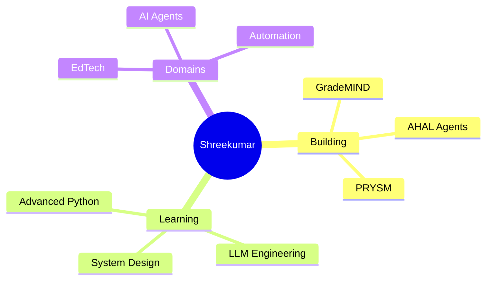

<div align="center">

<!-- ══════════════════════════════════════════════════════════════════════ -->
<!--                       ANIMATED HEADER BANNER                          -->
<!-- ══════════════════════════════════════════════════════════════════════ -->


<!-- ══════════════════════════════════════════════════════════════════════ -->
<!--                          TYPING ANIMATION                             -->
<!-- ══════════════════════════════════════════════════════════════════════ -->

[](https://git.io/typing-svg)

<br/>

<!-- ══════════════════════════════════════════════════════════════════════ -->
<!--                          QUICK CONNECT ROW                            -->
<!-- ══════════════════════════════════════════════════════════════════════ -->

[](https://shreekumardev.netlify.app/)
[](https://linkedin.com/in/shreekumar-b-103922381/)
[](mailto:bsrikumar855@gmail.com)

</div>

---

<!-- ══════════════════════════════════════════════════════════════════════ -->
<!--                            ABOUT ME SECTION                           -->
<!-- ══════════════════════════════════════════════════════════════════════ -->


## 🧠 About Me

```python
class ShreeKumar:
    def __init__(self):
        self.name      = "Shreekumar B"
        self.location  = "India 🇮🇳"
        self.role      = "AI & DS Student · AI Builder"
        self.building  = "GradeMIND — AI answer sheet validation"
        self.learning  = ["System Design", "LLM Engineering"]
        self.interests = ["AI Agents", "Automation", "EdTech"]
        self.motto     = "If you want to crack the system, first understand the system."

    def say_hi(self):
        return "Thanks for dropping by — let's build something great 🚀"
```

- 🎯 **Currently building:** [GradeMIND](https://github.com/bsrikumar855-dot?tab=repositories) — an AI-powered answer sheet validation system for educators
- 🤖 **Focus areas:** AI agents, developer tooling, and EdTech automation
- 🌱 **Leveling up in:** system design and production-grade LLM pipelines
- 💬 **Ask me about:** Python, FastAPI, LangChain, building with LLM APIs

<br clear="both" />

---

<!-- ══════════════════════════════════════════════════════════════════════ -->
<!--                        FEATURED PROJECTS                              -->
<!-- ══════════════════════════════════════════════════════════════════════ -->

## 🏆 Featured Projects

<table align="center">
<tr>
<td width="50%" valign="top">

### 🧠 [GradeMIND](https://github.com/bsrikumar855-dot?tab=repositories)
**AI-powered answer sheet validation system**

Automates evaluation of handwritten answer sheets using computer vision + LLM reasoning — built for real classrooms, not demos.

`Python` `Computer Vision` `LLMs`

🔥 **Flagship · In active development**

</td>
<td width="50%" valign="top">

### 🛡️ [PRYSM](https://github.com/bsrikumar855-dot/PRYSM---Continuous-AI-Compilance-Operating-System)
**Continuous AI Compliance Operating System**

A framework for monitoring and enforcing compliance in AI systems, continuously rather than as a one-time audit.

`TypeScript` `AI Governance`

⭐ 2 stars

</td>
</tr>
<tr>
<td width="50%" valign="top">

### 🤖 [AHAL-V2](https://github.com/bsrikumar855-dot/AHAL-V2)
**AI-Powered Developer Intelligence System**

Second-generation developer intelligence platform — agents that understand codebases and automate dev workflows.

`Python` `LLM Agents`

⭐ 2 stars · Successor to [AHAL-AI](https://github.com/bsrikumar855-dot/AHAL-AI)

</td>
<td width="50%" valign="top">

### 📹 [CCTV Live Monitoring](https://github.com/bsrikumar855-dot/CCTV-live-Monitoring)
**Real-time CCTV monitoring with AI detection**

Live video feed analysis with AI-based detection for security monitoring use cases.

`Python` `OpenCV` `Computer Vision`

⭐ 1 star

</td>
</tr>
</table>

<div align="center">

**🎨 Also:** [Vidiyal UI/UX](https://github.com/bsrikumar855-dot/Vidiyal-UI-UX) — a modern design system built with TypeScript & React

</div>

---

<!-- ══════════════════════════════════════════════════════════════════════ -->
<!--                          TECH STACK SECTION                           -->
<!-- ══════════════════════════════════════════════════════════════════════ -->

## 🛠️ Tech Stack

<div align="center">

**Languages**


**AI / ML**


**Frameworks & Backend**


**Tools**


</div>

---

<!-- ══════════════════════════════════════════════════════════════════════ -->
<!--                          CURRENT FOCUS MAP                            -->
<!-- ══════════════════════════════════════════════════════════════════════ -->

## 🚀 Current Focus



---

<!-- ══════════════════════════════════════════════════════════════════════ -->
<!--                         GITHUB STATS                                  -->
<!-- ══════════════════════════════════════════════════════════════════════ -->

## 📊 GitHub Activity

<div align="center">


<br/><br/>

[](https://github.com/bsrikumar855-dot)

</div>

---

<!-- ══════════════════════════════════════════════════════════════════════ -->
<!--                           CONNECT SECTION                             -->
<!-- ══════════════════════════════════════════════════════════════════════ -->

## 🌐 Let's Connect

<div align="center">

I'm always up for talking about **AI agents, EdTech, or building things that ship.**
Open to collaborations, internships, and interesting problems.

<br/>

[](https://shreekumardev.netlify.app/)
[](https://linkedin.com/in/shreekumar-b-103922381/)
[](mailto:bsrikumar855@gmail.com)

<br/>

> *"If you want to crack the system, first understand the system."*


**⭐ If any of my projects help you, a star means a lot — it keeps me building.**

</div>
