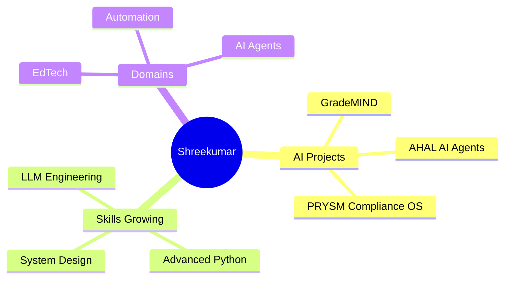

<div align="center">

<!-- ══════════════════════════════════════════════════════════════════════ -->
<!--                       ANIMATED HEADER BANNER                          -->
<!-- ══════════════════════════════════════════════════════════════════════ -->


<!-- ══════════════════════════════════════════════════════════════════════ -->
<!--                          TYPING ANIMATION                             -->
<!-- ══════════════════════════════════════════════════════════════════════ -->

[](https://git.io/typing-svg)

<!-- ══════════════════════════════════════════════════════════════════════ -->
<!--                         PROFILE VISITOR BADGE                         -->
<!-- ══════════════════════════════════════════════════════════════════════ -->


&nbsp;

&nbsp;


</div>

---

<!-- ══════════════════════════════════════════════════════════════════════ -->
<!--                            ABOUT ME SECTION                           -->
<!-- ══════════════════════════════════════════════════════════════════════ -->


## 🧠 About Me

```python
class ShreeKumar:
    def __init__(self):
        self.name        = "Shreekumar B"
        self.username    = "bsrikumar855-dot"
        self.location    = "India 🇮🇳"
        self.role        = "AI&DS Student & AI Builder"
        self.currently   = "Building GradeMIND 🎯"
        self.learning    = ["System Design", "Advanced Python"]
        self.interests   = ["AI Agents", "Automation", "EdTech"]
        self.motto       = "Build. Ship. Learn. Repeat."
    
    def say_hi(self):
        print("Thanks for dropping by! Let's build something great 🚀")

me = ShreeKumar()
me.say_hi()
```

<br clear="both" />

---

<!-- ══════════════════════════════════════════════════════════════════════ -->
<!--                          TECH STACK SECTION                           -->
<!-- ══════════════════════════════════════════════════════════════════════ -->

## 🛠️ Tech Stack & Tools

<div align="center">

### 💻 Languages


### 🚀 Frameworks & Libraries


### 🗄️ Databases


### 🤖 AI / ML


### 🔧 Tools & DevOps


</div>

---

<!-- ══════════════════════════════════════════════════════════════════════ -->
<!--                        FEATURED PROJECTS                              -->
<!-- ══════════════════════════════════════════════════════════════════════ -->

## 🏆 Featured Projects

<div align="center">

| 🎯 Project | 📝 Description | 🛠 Stack | ⭐ |
|:---:|:---:|:---:|:---:|
| [**GradeMIND**](https://github.com/bsrikumar855-dot) | AI-powered answer sheet validation system | Python · AI · CV | 🔥 Active |
| [**AHAL-V2**](https://github.com/bsrikumar855-dot/AHAL-V2) | AI-Powered Developer Intelligence System | Python · LLM | ⭐ 2 |
| [**PRYSM**](https://github.com/bsrikumar855-dot/PRYSM---Continuous-AI-Compilance-Operating-System) | Continuous AI Compliance Operating System | TypeScript · AI | ⭐ 2 |
| [**AHAL-AI**](https://github.com/bsrikumar855-dot/AHAL-AI) | Developer intelligence & automation platform | Python · AI Agents | ⭐ 1 |
| [**Vidiyal UI/UX**](https://github.com/bsrikumar855-dot/Vidiyal-UI-UX) | Modern UI/UX design system | TypeScript · React | ⭐ 1 |
| [**CCTV Monitor**](https://github.com/bsrikumar855-dot/CCTV-live-Monitoring) | Live CCTV monitoring with AI detection | Python · CV | ⭐ 1 |

</div>

---

<!-- ══════════════════════════════════════════════════════════════════════ -->
<!--                         GITHUB STATS                                  -->
<!-- ══════════════════════════════════════════════════════════════════════ -->

## 📊 GitHub Stats

<div align="center">


<br/>


</div>

---

<!-- ══════════════════════════════════════════════════════════════════════ -->
<!--                         CONTRIBUTION GRAPH                            -->
<!-- ══════════════════════════════════════════════════════════════════════ -->

## 📈 Contribution Graph

<div align="center">

[](https://github.com/ashutosh00710/github-readme-activity-graph)

</div>
<!-- ══════════════════════════════════════════════════════════════════════ -->
<!--                        SKILLS PROGRESS BARS                           -->
<!-- ══════════════════════════════════════════════════════════════════════ -->

## 💡 Skills & Expertise

```
Python          ████████████████████░░   88%  ⭐ Expert
TypeScript      ████████████████████░░   85%  🔥 Advanced
JavaScript      ██████████████████░░░░   75%  🔥 Advanced
React           ███████████████░░░░░░░   65%  🛠 Proficient
AI/ML           █████████████████░░░░░   72%  🤖 Advanced
System Design   ████████████░░░░░░░░░░   50%  🌱 Learning
```

---

<!-- ══════════════════════════════════════════════════════════════════════ -->
<!--                          WHAT I'M BUILDING                            -->
<!-- ══════════════════════════════════════════════════════════════════════ -->

## 🚀 Current Focus

<div align="center">



</div>

---

<!-- ══════════════════════════════════════════════════════════════════════ -->
<!--                           CONNECT SECTION                             -->
<!-- ══════════════════════════════════════════════════════════════════════ -->

## 🌐 Connect With Me

<div align="center">

[](https://github.com/bsrikumar855-dot)
[](https://linkedin.com/in/shreekumar-b-103922381/)
[](https://your-portfolio.com](https://shreekumardev.netlify.app/))
[](mailto:bsrikumar855@gmail.com)

</div>

---

<!-- ══════════════════════════════════════════════════════════════════════ -->
<!--                          MOTIVATIONAL QUOTE                           -->
<!-- ══════════════════════════════════════════════════════════════════════ -->

<div align="center">

### 💬 Dev Philosophy

> *"If you want to crack the system, First Understand the system..!"*
>
> — Shreekumar B

<br/>


</div>

---

<div align="center">


**⭐ Star my repos if you find them helpful! It motivates me to keep building.**

</div>
