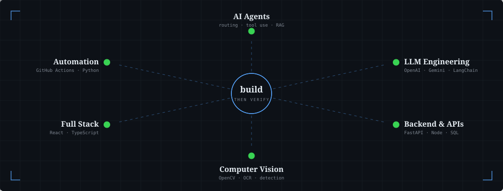

<picture>
  <source media="(prefers-color-scheme: dark)" srcset="./banner-dark.svg">
  <source media="(prefers-color-scheme: light)" srcset="./banner-light.svg">
  
</picture>

AI & Data Science student in India, building AI systems that other people actually use — agents
that read, decide and act, the backends that serve them, and the checks that stop them shipping
something wrong. Most of my work sits somewhere between education technology, developer tooling
and computer vision. I'd rather understand a problem properly than reach for a model first.

---

<picture>
  <source media="(prefers-color-scheme: dark)" srcset="./capabilities-dark.svg">
  <source media="(prefers-color-scheme: light)" srcset="./capabilities-light.svg">
  
</picture>

---

### What I build

**AI agents** — this is where most of my work lives. Not one-shot prompting: systems that
classify what's being asked, pick the right tool, call it, and reason over what comes back
before answering. A developer-intelligence agent that reads a codebase and automates the boring
parts of a dev workflow, a compliance system that watches AI behaviour continuously instead of
auditing it once, and a grading engine that has to defend every mark it gives.

**EdTech** — **GradeMIND** is the flagship. Handwritten answer sheets in, structured evaluation
out, built for real classrooms rather than a demo dataset. The hard part was never the OCR; it
was making the score explainable enough that a teacher would trust it.

**Computer vision** — OpenCV pipelines for live video and document images: handwriting
extraction, real-time detection on CCTV feeds, and the unglamorous preprocessing that decides
whether any of it works.

**Backends & full stack** — FastAPI and Node services, REST APIs, PostgreSQL and MySQL, React
and TypeScript on the front. Most of what I build ships behind an endpoint someone can call.

**Automation** — GitHub Actions, scheduled jobs and Python scripts doing the work I'd otherwise
do by hand twice a week.

### Running right now

**GradeMIND** — AI-powered answer sheet validation for educators. A scanned script goes through
vision and OCR, gets grounded against the actual rubric, is reasoned over by a model, and then
has to clear a validator before any mark is released. The interesting part is the failure path:
an answer the system can't justify against the rubric doesn't get a silent guess, it gets
flagged for the teacher. Grading that can't explain itself is worse than no grading at all.

In active development · `Python` · computer vision + LLM reasoning · built for classrooms

---

### Selected work

Five, on purpose — not a repo index. Each one exists to prove something different.

| | |
|---|---|
| **GradeMIND** | AI answer sheet validation for educators. Handwriting to structured evaluation, with a rubric-grounded validator between the model and the mark. Flagship, in active development. |
| **[PRYSM](https://github.com/bsrikumar855-dot/PRYSM---Continuous-AI-Compilance-Operating-System)** | A continuous AI compliance operating system. Most compliance is a one-time audit that goes stale the day after it passes; PRYSM treats it as a running process — monitoring AI behaviour continuously and enforcing policy while the system is live, not after. TypeScript. |
| **[AHAL-V2](https://github.com/bsrikumar855-dot/AHAL-V2)** | AI-powered developer intelligence. Agents that read a codebase, understand what's in it, and automate the parts of a dev workflow nobody wants to do by hand. Second generation — the rewrite of [AHAL-AI](https://github.com/bsrikumar855-dot/AHAL-AI) after the first version taught me what the architecture should have been. |
| **[CCTV-live-Monitoring](https://github.com/bsrikumar855-dot/CCTV-live-Monitoring)** | Real-time detection over live camera feeds. Latency and dropped frames are the actual problem — the model is the easy part. Python, OpenCV. |
| **[Vidiyal-UI-UX](https://github.com/bsrikumar855-dot/Vidiyal-UI-UX)** | A modern design system in TypeScript and React, built so the interface layer stops being an afterthought on my AI projects. |

The rest — experiments, tools and one-offs — are on
[GitHub](https://github.com/bsrikumar855-dot?tab=repositories) and the
[portfolio](https://shreekumardev.netlify.app/) if you want the full list.

---

### What building these actually taught me

**A model that can't be checked can't be trusted with a grade.** Early GradeMIND scored
confidently and wrongly, and confidently-wrong is the one failure mode a teacher will never
forgive. The fix wasn't a better prompt — it was making every mark traceable to a line in the
rubric, and refusing to emit one that isn't.

**Compliance decays quietly.** A system that passed an audit in January can drift by March and
nothing announces it. That's the whole reason PRYSM is continuous — the failures worth catching
are the ones nobody is watching for.

**The second version is where the design happens.** AHAL-AI worked, but every new capability
fought the structure. Rewriting it as AHAL-V2 cost less than another six months of working
around the first architecture.

---

### How my systems run

<picture>
  <source media="(prefers-color-scheme: dark)" srcset="./pipeline-dark.svg">
  <source media="(prefers-color-scheme: light)" srcset="./pipeline-light.svg">
  
</picture>

Input gets parsed, grounded against the rules that apply to it, reasoned over, and then checked.
If the check fails, it loops back and repairs rather than shipping. The validator is the part
that makes the rest of it usable by someone who isn't me.

---

### Working with

`Python` · `TypeScript` · `JavaScript` · `FastAPI` · `Node.js` · `React` · `OpenCV` · `LangChain` · `LLM APIs` · `RAG` · `AI agents` · `PostgreSQL` · `MySQL` · `Docker` · `GitHub Actions` · `HTML/CSS` · `Git`

Currently levelling up on system design and production-grade LLM pipelines.

---

<picture>
  <source media="(prefers-color-scheme: dark)" srcset="https://raw.githubusercontent.com/bsrikumar855-dot/bsrikumar855-dot/output/snake-dark.svg">
  <source media="(prefers-color-scheme: light)" srcset="https://raw.githubusercontent.com/bsrikumar855-dot/bsrikumar855-dot/output/snake-light.svg">
  
</picture>

---

[Portfolio](https://shreekumardev.netlify.app/) · [LinkedIn](https://linkedin.com/in/shreekumar-b-103922381/) · bsrikumar855@gmail.com

> *If you want to crack the system, first understand the system.*
